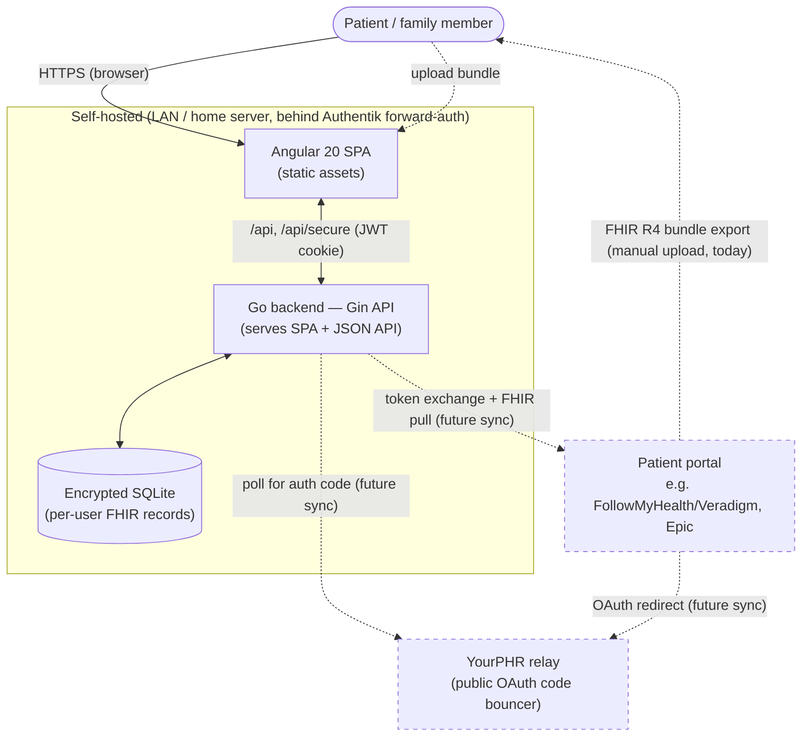
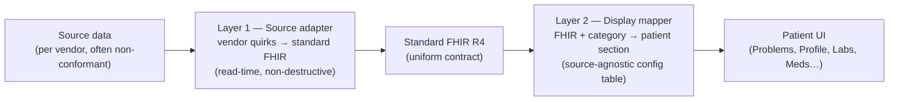
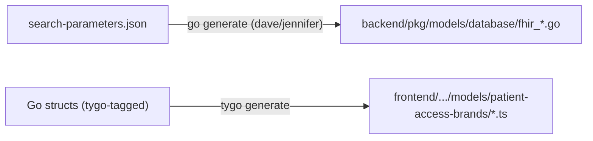
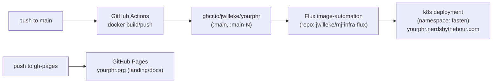

# YourPHR — Architecture

The single, leading map of how YourPHR fits together. Start here, then follow the links into the deep-dive docs. The detailed designs live in their own files (display, security, SMART relay, conformance); this page is the index and the high-level picture, not a duplicate of them.

> **Mission: Your medical records, immediately and in your hands — for free.** (Fulfilling the [21st Century Cures Act](https://www.healthit.gov/topic/oncs-cures-act-final-rule), 2016.) Every architectural choice is judged against one question: *does it advance immediate, complete patient access to records?*

## What YourPHR is

A **self-hosted personal/family Personal Health Record (PHR) viewer** — a standalone, community-maintained continuation of [Fasten OnPrem](https://github.com/fastenhealth/fasten-onprem) (GPL v3, attribution retained; see [`../README.md`](../README.md)). A **Go backend** (Gin + GORM, encrypted SQLite) serves a JSON API and the compiled **Angular 20** single-page app. It imports **FHIR R4** bundles — today by manual upload; live provider sync is a roadmap item (see [Roadmap](./Roadmap.md)).

It is a **display-only client**, not an EHR and not a FHIR server: it requests/imports records and presents them legibly. That framing drives the conformance posture (see [US Core support](./us-core/README.md)).

> **Identifier note:** the product is **YourPHR**, but the Go module path stays `github.com/fastenhealth/fasten-onprem`, and upstream-tied technical names (`fasten-sources`, `FastenDisplayModel`, the k8s `fasten` namespace) are kept on purpose. Only user-facing strings are "YourPHR". See EPIC [#2](https://github.com/jwilleke/yourphr/issues/2) and [`../CLAUDE.md`](../CLAUDE.md).

## System context



Dashed paths are **roadmap / not yet functional** in this fork: `fasten-sources` is a local stub, so live provider sync does not work yet — manual bundle upload is the supported import path. See [SMART on FHIR plan](./planning/smart-on-fhir/smart-on-fhir.md).

## Component map

| Layer | Tech / location | Notes |
|---|---|---|
| **Frontend** | Angular 20 SPA — `frontend/src/app/` | Upgraded 14→20 (epic [#12](https://github.com/jwilleke/yourphr/issues/12)). Served as static assets by the backend. `fasten-api.service.ts` is the API client; JWT in an HttpOnly cookie ([#103](https://github.com/jwilleke/yourphr/issues/103)). |
| **Web / API** | Gin router — [`../backend/pkg/web/server.go`](../backend/pkg/web/server.go), handlers in `backend/pkg/web/handler/` | Route groups: `/api` (public — auth, glossary, CORS proxy), `/api/secure` (behind `RequireAuth()` JWT), `/api/unsafe` (dev-only, off by default). SSE at `/api/secure/events/stream`. |
| **Auth** | `backend/pkg/auth/` + bcrypt | HS256 JWT (algorithm-pinned), bcrypt cost 14. 1h session token + DB-backed long-lived "access" tokens. Admin gate re-reads role from DB, not the JWT claim. |
| **Data access** | `DatabaseRepository` interface — [`../backend/pkg/database/interface.go`](../backend/pkg/database/interface.go) | The single data-access contract. GORM impl over **encrypted SQLite** (the only working store). Construct via `factory.go`. Per-user scoping centralized via `GetCurrentUser(ctx)`. Postgres exists but is **broken/unsupported**. |
| **FHIR models** | ~70 generated `backend/pkg/models/database/fhir_*.go` | **Generated — never hand-edit.** Each runs FHIRPath via the **goja** JS engine (`searchParameterExtractor.js`) to flatten searchable fields into indexed SQLite columns. |
| **Display models** | `FastenDisplayModel` + frontend view-models | Turn stored FHIR into patient-legible sections. See [the display architecture](#the-display-architecture). |
| **Relay** | [`../backend/cmd/relay/`](../backend/cmd/relay/) | Tiny stateless public **store-and-poll** OAuth `code` bouncer. Never sees tokens, holds no provider registration. EPIC [#20](https://github.com/jwilleke/yourphr/issues/20). |
| **Sources** | `fasten-sources` replaced by a local **stub** (`./fasten-sources-stub`, `replace` in `go.mod`) | Catalog/client interfaces only; no real OAuth clients → live sync non-functional. |
| **Entry point** | [`../backend/cmd/fasten/fasten.go`](../backend/cmd/fasten/fasten.go) | urfave/cli app: `start`, `migrate`, `version`. |

## Key flows

### Import & display (the supported path today)

```mermaid
sequenceDiagram
    actor P as Patient
    participant SPA as Angular SPA
    participant API as Gin API
    participant DB as Encrypted SQLite
    P->>SPA: Upload FHIR R4 bundle
    SPA->>API: POST bundle (/api/secure)
    API->>API: Parse resources; goja FHIRPath extraction → indexed columns
    API->>DB: Store raw FHIR + search params (scoped to UserID)
    Note over API,DB: Raw FHIR is stored verbatim — never mutated
    P->>SPA: Open dashboard / record
    SPA->>API: GET /api/secure/... (JWT cookie)
    API->>DB: Query (per-user)
    API->>API: Layer 1 reconcile (read-time) → Layer 2 display mapping
    API-->>SPA: Patient-legible view models
```

### Live provider sync (roadmap — relay store-and-poll)

```mermaid
sequenceDiagram
    actor P as Patient
    participant SPA as Angular SPA
    participant Prov as Provider (SMART/FHIR)
    participant Relay as Public relay
    participant API as Local YourPHR
    P->>Prov: Authorize (browser, BYO client_id)
    Prov->>Relay: redirect /callback?code&state
    Relay->>Relay: store {state: code}, ~60s TTL
    API->>Relay: poll /pending?state (X-Yourphr-Token secret)
    Relay-->>API: code (then deletes it)
    API->>Prov: exchange code → tokens (local, direct)
    API->>Prov: pull FHIR ($everything)
    Note over Relay: never sees tokens; provider-agnostic
```

Why a relay at all: a LAN/NAT instance has no public `redirect_uri`, but providers require one. The relay is the only public piece; the instance stays outbound-only. Deep dive: [`oauth-gateway.md`](./planning/smart-on-fhir/oauth-gateway.md).

## The display architecture

This is the heart of YourPHR's value — turning messy, vendor-specific FHIR into something a patient can actually read. **Two independent layers meet at one contract: standard FHIR R4.**



- **Layer 1 (per-vendor)** is the *only* place vendor-specific logic lives. It runs as a **non-destructive read-time reconcile view-model** — raw FHIR is never mutated. Its central job is synthesizing the standard fields the source omitted (most importantly `Condition.category`) and resolving provenance/reference quirks.
- **Layer 2 (source-agnostic)** keys only off standard FHIR. Add a conformant source (Epic, Cerner) and it flows through with **zero new display code**.

Governing principles: **patient-legible** ([#262](https://github.com/jwilleke/yourphr/issues/262) — meaning first, translate codes, plain language), **no-guessing** (display only from explicit record signals; absent → "unknown", never inferred), and **no dedup** (report facts as the source gave them).

**Deep dives:**

- [Classification & display architecture](./your-phr-dashboard/classification-and-display-architecture.md) — the two-layer model in full, condition-classifier decision table, provenance resolver, FollowMyHealth reference quirks.
- [Patient-legible display principle](./your-phr-dashboard/patient-legible-display.md) — the north star (#262).
- [The dashboard](./your-phr-dashboard/README.md) — config-driven home view; `backend/pkg/web/handler/dashboard/default.json` *is* a dashboard.
- [Phase 1 condition-classifier spec](./your-phr-dashboard/phase-1-condition-classifier-spec.md) · [Per-profile dashboards](./your-phr-dashboard/per-profile-dashboards-brainstorm.md)

## Code generation (don't hand-edit generated files)

Two generators produce committed files; re-run them when inputs change.



- `make generate-backend` runs both. Re-run after changing `search-parameters.json` or a tygo-exported Go struct, and **commit the regenerated files**.
- Details and conventions: [`../CLAUDE.md`](../CLAUDE.md) → "Code generation".

## Deployment & delivery



- **Running app:** `yourphr.nerdsbythehour.com` (internal/LAN, behind Authentik forward-auth). GitOps via **Flux** in [`jwilleke/mj-infra-flux`](https://github.com/jwilleke/mj-infra-flux) (`apps/production/fasten/`). The k8s app/namespace are still named `fasten`.
- **Project site:** [`yourphr.org`](https://yourphr.org) — GitHub Pages from the `gh-pages` branch (not the app).
- **Self-host:** Docker / `docker compose`; generates its own TLS CA at runtime. See [`../README.md`](../README.md).

## Security posture

Solid foundation for a self-hosted/family threat model behind forward-auth; **not yet hardened for direct public exposure.** The dominant residual risk is the **default HS256 JWT signing key with no forced rotation** ([#102](https://github.com/jwilleke/yourphr/issues/102)) — all per-user isolation trusts that signature.

Strengths worth knowing: centralized per-user scoping, DB-backed admin gate (JWT claim not trusted), a dedicated [SSRF guard](../backend/pkg/ssrf/ssrf.go), encrypted-DB standby mode, and a relay that never sees tokens.

**Full assessment + prioritized backlog:** [Architecture & security review](./planning/architecture-security-review.md). Standards mapping: [Standards conformance](./planning/Standards-Conformance.md).

## Known architectural tensions (read before large changes)

1. **Multi-user sharing is half-built.** The README describes admin/viewer roles and cross-user grants; the data layer scopes strictly to the current user with no real ACL. Designing the authorization layer **before** building sharing ([#256](https://github.com/jwilleke/yourphr/issues/256)) is far cheaper than retrofitting.
2. **SQLite is a known ceiling** for a lifetime, multi-family PHR (single-writer). Postgres is the documented escape hatch but is currently broken.
3. **Default JWT key** ([#102](https://github.com/jwilleke/yourphr/issues/102)) — see Security posture above; gating item before broader exposure.

## Where to read next — doc index

| Topic | Doc |
|---|---|
| **Roadmap & phasing** | [`Roadmap.md`](./Roadmap.md) |
| **Repo guide / conventions / commands** | [`../CLAUDE.md`](../CLAUDE.md) · [`../README.md`](../README.md) |
| **Display: classification & two-layer model** | [`your-phr-dashboard/classification-and-display-architecture.md`](./your-phr-dashboard/classification-and-display-architecture.md) |
| **Display: patient-legible north star** | [`your-phr-dashboard/patient-legible-display.md`](./your-phr-dashboard/patient-legible-display.md) |
| **Dashboard design** | [`your-phr-dashboard/README.md`](./your-phr-dashboard/README.md) |
| **Security & architecture review** | [`planning/architecture-security-review.md`](./planning/architecture-security-review.md) |
| **Standards conformance** | [`planning/Standards-Conformance.md`](./planning/Standards-Conformance.md) · [CSP](./planning/enforcing-CSP-issue.md) |
| **US Core support & coverage** | [`us-core/README.md`](./us-core/README.md) · [`us-core/conformance-coverage.md`](./us-core/conformance-coverage.md) |
| **SMART on FHIR / live sync** | [`planning/smart-on-fhir/smart-on-fhir.md`](./planning/smart-on-fhir/smart-on-fhir.md) · [`planning/smart-on-fhir/oauth-gateway.md`](./planning/smart-on-fhir/oauth-gateway.md) · [relay README](../backend/cmd/relay/README.md) |
| **Vendor specifics (FollowMyHealth/Veradigm/Epic)** | [`vendors/README.md`](./vendors/README.md) |
| **FHIR handling notes** | [`FHIR/fhir-testing.md`](./FHIR/fhir-testing.md) · [`FHIR/fhir-converter-local.md`](./FHIR/fhir-converter-local.md) · [`FHIR/fractional-quantity-values.md`](./FHIR/fractional-quantity-values.md) · [`FHIR/uncoded-questionnaires.md`](./FHIR/uncoded-questionnaires.md) |
| **Health-record ecosystem background** | [`planning/personal-health/health-record-aggregation.md`](./planning/personal-health/health-record-aggregation.md) · [`planning/personal-health/fastenhealth-ecosystem.md`](./planning/personal-health/fastenhealth-ecosystem.md) |

---

*This is a living document. When a component, flow, or deployment path changes materially, update the diagram and the relevant deep-dive doc — and keep this page as the index, not a second copy of the detail.*
