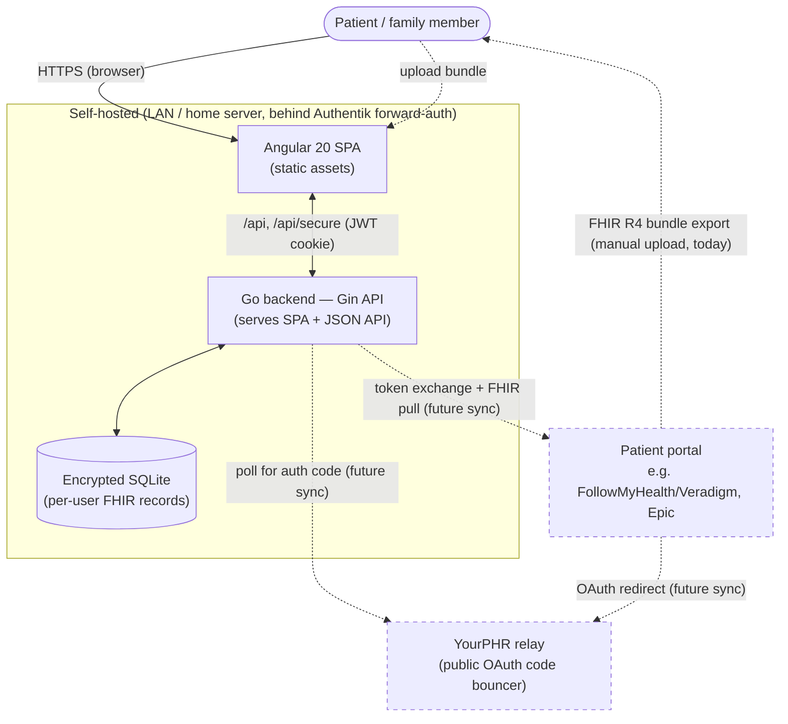
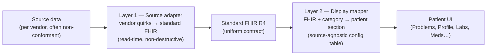
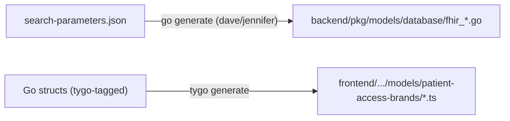
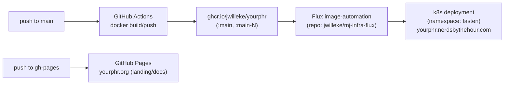

# YourPHR — Architecture

The single, leading map of how YourPHR fits together. Start here, then follow the links into the deep-dive docs. The detailed designs live in their own files (display, security, SMART relay, conformance); this page is the index and the high-level picture, not a duplicate of them.

> __Mission: Your medical records, immediately and in your hands — for free.__ (Fulfilling the [21st Century Cures Act](https://www.healthit.gov/topic/oncs-cures-act-final-rule), 2016.) Every architectural choice is judged against one question: *does it advance immediate, complete patient access to records?*

## What YourPHR is

A __self-hosted personal/family Personal Health Record (PHR) viewer__ — a standalone, community-maintained continuation of [Fasten OnPrem](https://github.com/fastenhealth/fasten-onprem) (GPL v3, attribution retained; see [`../README.md`](../README.md)). A __Go backend__ (Gin + GORM, encrypted SQLite) serves a JSON API and the compiled __Angular 20__ single-page app. It imports __FHIR R4__ bundles — today by manual upload; live provider sync is a roadmap item (see [Roadmap](./Roadmap.md)).

It is a __display-only client__, not an EHR and not a FHIR server: it requests/imports records and presents them legibly. That framing drives the conformance posture (see [US Core support](./us-core/README.md)).

> __Identifier note:__ the product is __YourPHR__, but the Go module path stays `github.com/fastenhealth/fasten-onprem`, and upstream-tied technical names (`fasten-sources`, `FastenDisplayModel`, the k8s `fasten` namespace) are kept on purpose. Only user-facing strings are "YourPHR". See EPIC [#2](https://github.com/jwilleke/yourphr/issues/2) and [`../AGENTS.md`](../AGENTS.md).

## System context

```mermaid
flowchart TB
    patient([Patient / family member])
    portal[Patient portal<br/>e.g. FollowMyHealth/Veradigm, Epic]

    subgraph self["Self-hosted (LAN / home server, behind Authentik forward-auth)"]
        spa["Angular 20 SPA<br/>(static assets)"]
        api["Go backend — Gin API<br/>(serves SPA + JSON API)"]
        db[("Encrypted SQLite<br/>(per-user FHIR records)")]
    end

    relay["YourPHR relay<br/>(public OAuth code bouncer)"]

    patient -->|"HTTPS (browser)"| spa
    spa <-->|"/api, /api/secure (JWT cookie)"| api
    api <--> db
    portal -.->|"FHIR R4 bundle export (manual upload, today)"| patient
    patient -.->|upload bundle| spa

    api -.->|"poll for auth code (future sync)"| relay
    portal -.->|"OAuth redirect (future sync)"| relay
    api -.->|"token exchange + FHIR pull (future sync)"| portal

    classDef future stroke-dasharray: 5 5;
    class relay,portal future;
```

Dashed paths are __roadmap / not yet functional__ in this fork: `fasten-sources` is a local stub, so live provider sync does not work yet — manual bundle upload is the supported import path. See [SMART on FHIR plan](./planning/smart-on-fhir/smart-on-fhir.md).

## Component map

| Layer | Tech / location | Notes |
|---|---|---|
| __Frontend__ | Angular 20 SPA — `frontend/src/app/` | Upgraded 14→20 (epic [#12](https://github.com/jwilleke/yourphr/issues/12)). Served as static assets by the backend. `fasten-api.service.ts` is the API client; JWT in an HttpOnly cookie ([#103](https://github.com/jwilleke/yourphr/issues/103)). |
| __Web / API__ | Gin router — [`../backend/pkg/web/server.go`](../backend/pkg/web/server.go), handlers in `backend/pkg/web/handler/` | Route groups: `/api` (public — auth, glossary, CORS proxy), `/api/secure` (behind `RequireAuth()` JWT), `/api/unsafe` (dev-only, off by default). SSE at `/api/secure/events/stream`. |
| __Auth__ | `backend/pkg/auth/` + bcrypt | HS256 JWT (algorithm-pinned), bcrypt cost 14. 1h session token + DB-backed long-lived "access" tokens. Admin gate re-reads role from DB, not the JWT claim. |
| __Data access__ | `DatabaseRepository` interface — [`../backend/pkg/database/interface.go`](../backend/pkg/database/interface.go) | The single data-access contract. GORM impl over __encrypted SQLite__ (the only working store). Construct via `factory.go`. Per-user scoping centralized via `GetCurrentUser(ctx)`. Postgres exists but is __broken/unsupported__. |
| __FHIR models__ | ~70 generated `backend/pkg/models/database/fhir_*.go` | __Generated — never hand-edit.__ Each runs FHIRPath via the __goja__ JS engine (`searchParameterExtractor.js`) to flatten searchable fields into indexed SQLite columns. |
| __Display models__ | `FastenDisplayModel` + frontend view-models | Turn stored FHIR into patient-legible sections. See [the display architecture](#the-display-architecture). |
| __Relay__ | [`../backend/cmd/relay/`](../backend/cmd/relay/) | Tiny stateless public __store-and-poll__ OAuth `code` bouncer. Never sees tokens, holds no provider registration. EPIC [#20](https://github.com/jwilleke/yourphr/issues/20). |
| __Sources__ | `fasten-sources` replaced by a local __stub__ (`./fasten-sources-stub`, `replace` in `go.mod`) | Catalog/client interfaces only; no real OAuth clients → live sync non-functional. |
| __Entry point__ | [`../backend/cmd/fasten/fasten.go`](../backend/cmd/fasten/fasten.go) | urfave/cli app: `start`, `migrate`, `version`. |

## Key flows

### Import & display (the supported path today)

```mermaid
sequenceDiagram
    actor P as Patient
    participant SPA as Angular SPA
    participant API as Gin API
    participant DB as Encrypted SQLite
    P->>SPA: Upload FHIR R4 bundle
    SPA->>API: POST bundle (/api/secure)
    API->>API: Parse resources; goja FHIRPath extraction → indexed columns
    API->>DB: Store raw FHIR + search params (scoped to UserID)
    Note over API,DB: Raw FHIR is stored verbatim — never mutated
    P->>SPA: Open dashboard / record
    SPA->>API: GET /api/secure/... (JWT cookie)
    API->>DB: Query (per-user)
    API->>API: Layer 1 reconcile (read-time) → Layer 2 display mapping
    API-->>SPA: Patient-legible view models
```

### Live provider sync (roadmap — relay store-and-poll)

```mermaid
sequenceDiagram
    actor P as Patient
    participant SPA as Angular SPA
    participant Prov as Provider (SMART/FHIR)
    participant Relay as Public relay
    participant API as Local YourPHR
    P->>Prov: Authorize (browser, BYO client_id)
    Prov->>Relay: redirect /callback?code&state
    Relay->>Relay: store {state: code}, ~60s TTL
    API->>Relay: poll /pending?state (X-Yourphr-Token secret)
    Relay-->>API: code (then deletes it)
    API->>Prov: exchange code → tokens (local, direct)
    API->>Prov: pull FHIR ($everything)
    Note over Relay: never sees tokens; provider-agnostic
```

Why a relay at all: a LAN/NAT instance has no public `redirect_uri`, but providers require one. The relay is the only public piece; the instance stays outbound-only. Deep dive: [`oauth-gateway.md`](./planning/smart-on-fhir/oauth-gateway.md).

## The display architecture

This is the heart of YourPHR's value — turning messy, vendor-specific FHIR into something a patient can actually read. __Two independent layers meet at one contract: standard FHIR R4.__

```mermaid
flowchart LR
    src["Source data<br/>(per vendor, often non-conformant)"]
    L1["Layer 1 — Source adapter<br/>vendor quirks → standard FHIR<br/>(read-time, non-destructive)"]
    fhir["Standard FHIR R4<br/>(uniform contract)"]
    L2["Layer 2 — Display mapper<br/>FHIR + category → patient section<br/>(source-agnostic config table)"]
    ui["Patient UI<br/>(Problems, Profile, Labs, Meds…)"]
    src --> L1 --> fhir --> L2 --> ui
```

- __Layer 1 (per-vendor)__ is the *only* place vendor-specific logic lives. It runs as a __non-destructive read-time reconcile view-model__ — raw FHIR is never mutated. Its central job is synthesizing the standard fields the source omitted (most importantly `Condition.category`) and resolving provenance/reference quirks.
- __Layer 2 (source-agnostic)__ keys only off standard FHIR. Add a conformant source (Epic, Cerner) and it flows through with __zero new display code__.

Governing principles: __patient-legible__ ([#262](https://github.com/jwilleke/yourphr/issues/262) — meaning first, translate codes, plain language), __no-guessing__ (display only from explicit record signals; absent → "unknown", never inferred), and __no dedup__ (report facts as the source gave them).

__Deep dives:__

- [Classification & display architecture](./your-phr-dashboard/classification-and-display-architecture.md) — the two-layer model in full, condition-classifier decision table, provenance resolver, FollowMyHealth reference quirks.
- [Patient-legible display principle](./your-phr-dashboard/patient-legible-display.md) — the north star (#262).
- [The dashboard](./your-phr-dashboard/README.md) — config-driven home view; `backend/pkg/web/handler/dashboard/default.json` *is* a dashboard.
- [Phase 1 condition-classifier spec](./your-phr-dashboard/phase-1-condition-classifier-spec.md) · [Per-profile dashboards](./your-phr-dashboard/per-profile-dashboards-brainstorm.md)

## Code generation (don't hand-edit generated files)

Two generators produce committed files; re-run them when inputs change.

```mermaid
flowchart LR
    sp["search-parameters.json"] -->|"go generate (dave/jennifer)"| fhirgo["backend/pkg/models/database/fhir_*.go"]
    gostructs["Go structs (tygo-tagged)"] -->|"tygo generate"| ts["frontend/.../models/patient-access-brands/*.ts"]
```

- `make generate-backend` runs both. Re-run after changing `search-parameters.json` or a tygo-exported Go struct, and __commit the regenerated files__.
- Details and conventions: [`../AGENTS.md`](../AGENTS.md) → "Code generation".

## Deployment & delivery

```mermaid
flowchart LR
    dev["push to main"] --> gha["GitHub Actions<br/>docker build/push"]
    gha --> ghcr["ghcr.io/jwilleke/yourphr<br/>(:main, :main-N)"]
    ghcr --> flux["Flux image-automation<br/>(repo: jwilleke/mj-infra-flux)"]
    flux --> k8s["k8s deployment<br/>(namespace: fasten)<br/>yourphr.nerdsbythehour.com"]
    dev2["push to gh-pages"] --> pages["GitHub Pages<br/>yourphr.org (landing/docs)"]
```

- __Running app:__ `yourphr.nerdsbythehour.com` (internal/LAN, behind Authentik forward-auth). GitOps via __Flux__ in [`jwilleke/mj-infra-flux`](https://github.com/jwilleke/mj-infra-flux) (`apps/production/fasten/`). The k8s app/namespace are still named `fasten`.
- __Project site:__ [`yourphr.org`](https://yourphr.org) — GitHub Pages from the `gh-pages` branch (not the app).
- __Self-host:__ Docker / `docker compose`; generates its own TLS CA at runtime. See [`../README.md`](../README.md).

## Security posture

Solid foundation for a self-hosted/family threat model behind forward-auth; __not yet hardened for direct public exposure.__ The dominant residual risk is the __default HS256 JWT signing key with no forced rotation__ ([#102](https://github.com/jwilleke/yourphr/issues/102)) — all per-user isolation trusts that signature.

Strengths worth knowing: centralized per-user scoping, DB-backed admin gate (JWT claim not trusted), a dedicated [SSRF guard](../backend/pkg/ssrf/ssrf.go), encrypted-DB standby mode, and a relay that never sees tokens.

__Full assessment + prioritized backlog:__ [Architecture & security review](./planning/architecture-security-review.md). Standards mapping: [Standards conformance](./planning/Standards-Conformance.md).

## Known architectural tensions (read before large changes)

1. __Multi-user sharing is half-built.__ The README describes admin/viewer roles and cross-user grants; the data layer scopes strictly to the current user with no real ACL. Designing the authorization layer __before__ building sharing ([#256](https://github.com/jwilleke/yourphr/issues/256)) is far cheaper than retrofitting.
2. __SQLite is a known ceiling__ for a lifetime, multi-family PHR (single-writer). Postgres is the documented escape hatch but is currently broken.
3. __Default JWT key__ ([#102](https://github.com/jwilleke/yourphr/issues/102)) — see Security posture above; gating item before broader exposure.

## Where to read next — doc index

| Topic | Doc |
|---|---|
| __Roadmap & phasing__ | [`Roadmap.md`](./Roadmap.md) |
| __Repo guide / conventions / commands__ | [`../AGENTS.md`](../AGENTS.md) · [`../README.md`](../README.md) |
| __Display: classification & two-layer model__ | [`your-phr-dashboard/classification-and-display-architecture.md`](./your-phr-dashboard/classification-and-display-architecture.md) |
| __Display: patient-legible north star__ | [`your-phr-dashboard/patient-legible-display.md`](./your-phr-dashboard/patient-legible-display.md) |
| __Dashboard design__ | [`your-phr-dashboard/README.md`](./your-phr-dashboard/README.md) |
| __Security & architecture review__ | [`planning/architecture-security-review.md`](./planning/architecture-security-review.md) |
| __Standards conformance__ | [`planning/Standards-Conformance.md`](./planning/Standards-Conformance.md) · [CSP](./planning/enforcing-CSP-issue.md) |
| __US Core support & coverage__ | [`us-core/README.md`](./us-core/README.md) · [`us-core/conformance-coverage.md`](./us-core/conformance-coverage.md) |
| __SMART on FHIR / live sync__ | [`planning/smart-on-fhir/smart-on-fhir.md`](./planning/smart-on-fhir/smart-on-fhir.md) · [`planning/smart-on-fhir/oauth-gateway.md`](./planning/smart-on-fhir/oauth-gateway.md) · [relay README](../backend/cmd/relay/README.md) |
| __Vendor specifics (FollowMyHealth/Veradigm/Epic)__ | [`vendors/README.md`](./vendors/README.md) |
| __FHIR handling notes__ | [`FHIR/fhir-testing.md`](./FHIR/fhir-testing.md) · [`FHIR/fhir-converter-local.md`](./FHIR/fhir-converter-local.md) · [`FHIR/fractional-quantity-values.md`](./FHIR/fractional-quantity-values.md) · [`FHIR/uncoded-questionnaires.md`](./FHIR/uncoded-questionnaires.md) |
| __Health-record ecosystem background__ | [`planning/personal-health/health-record-aggregation.md`](./planning/personal-health/health-record-aggregation.md) · [`planning/personal-health/fastenhealth-ecosystem.md`](./planning/personal-health/fastenhealth-ecosystem.md) |

---

*This is a living document. When a component, flow, or deployment path changes materially, update the diagram and the relevant deep-dive doc — and keep this page as the index, not a second copy of the detail.*
